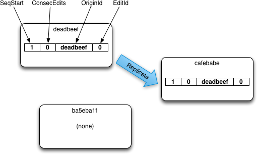

Conflict Handling using Rev Trees Functional Specification
=======================================

# INTRODUCTION

## Purpose of this Document

This document describes the functionality and high level data structures of revision trees to support conflict management.

## Motivation

With Cross DataCenter Replication (XDCR) linking clusters, it is easy to create conflicting updates for a document by editing a document in more than one cluster at roughly the same time. Currently XDCR will arbitrarily select the same document version on both clusters as the winner and irretrievably discard the loser(s).

Within a cluster, it's also possible that there is a network partition where a client and server node are separated from the rest of the cluster and the node is "failed out" from the cluster. If clients on both sides of the partition edits the same document, there are currently irretrievably lost edits.

With proper conflict management -- which will store all conflicting document versions until resolution -- it will be possible to identify the conflicts and merge the documents with either built-in server features, an external automated agent, or an end user, so no information is lost.

## Scope of this Document

This document will describe the high level algorithms and data structures necessary to implement the core of conflict management. It will not specify implementation details, or required changes in existing code necessary to support the implementation.

## Basics of Rev Trees

### What they do

The purpose of Rev Tree's is to establish a relationship between the most recent edits of a document that exists on different machines. The relationship that edits can have are:

1. Both are at same edit.
2. One edit is based on another edit.
3. The edits are in conflict.

When 1 or 2 are established, it means the edits are "correct" and correct state of the document is not in question.

When 3 happens, it means the document was edited on multiple nodes before a successful XDCR replication occurred, and now the edits are not correctly ordered and it's possible the edits have 2 unique and valid states, it is in conflict.

When this happens Couchbase will store both edits, pick an interim winner (the same winner will be selected on all nodes) and "hide" the losing conflict(s) and mark the document as being in conflict so that it can found, using views and other searches, by an external agents who can potentially resolve the conflicts.

### How they do it

Each time a document is created, edited or deleted, a revision entry (rev) is added to the document's rev history, or an existing "leaf" entry is updated. Each revision entry is made up of these fields with these sizes:

<table>
	<tr>
		<th>Description
		<td>SeqStart
		<td>ConsecEdits
		<td>OriginId
		<td>EditId
	<tr>
		<th>Type
		<td>48bit uint
		<td>32bit uint
		<td>128bit UUID
		<td>32bit uint
</table>

**SeqStart**: The total number of edits on this document since the start of time.

**ConsecEdits**: The total number of consecutive edits made on this document by the same node.

**OriginId**: The UUID of partition master that originated the edit(s). OriginIds can be moved to another node when there is smooth rebalance. When the master node crashes or is unavailable, the new master (which might be the same physical node) is given a new id. Only one node at any time will have a particular id. We will likely be reusing the FailoverId which is part of UPR.

**EditId**: A value that when combined with the OriginId and SeqStart, is unique to all branches/conflicts.

When updating a document and the most recent Rev has a different OriginID from the current partition master node's FailoverID, a new Rev is added to the revision history, with a SeqStart that is the sum of the previous Rev SeqStart and ConsecEdits, an ConseqEdits of 0, a OriginId that is the current FailoverId, and an EditId that is unique different from any matching OriginId for this document or it's conflicts. If the edit is a consecutive edits by the same node/FailoverId, only the ConsecEdits is increments.

If a document is only ever edited at the same master node, the revision history will not grow, and instead the ConsecEdits will keep incrementing. If the ConsecEdits reaches it's maximum value (2^32), a new rev entry will created and added to the history. Logically the 2 or more consecutive revs with the same OriginId will be considered a single rev entry.

If a document is edited on multiple servers, it's possible for edit conflicts to occur. When an edit conflict happens, there will be a "branch" in the rev history. The branches can have a common rev in the history, or be completely detached with no common element.

When there is a edit conflict, each server selects an interim "winner", which is decided by:

1. Prefer non-deleted revs to deleted revs.
2. Prefer rev with the most edits.
3. Prefer rev with the highest sorting OriginId.
4. Prefer rev with the highest EditId.

All nodes, if they have the same revisions, will select the same document as the interim winner.

Here is an example of a single rev history tree consisting of 3 branches and therefore 2 conflicts and 1 interim winner:

The rev 5-0-deadbeef-2, in **bold**, is the interim winner.

### Stemming old revs

Once all nodes have seen a revision in the history, and that revision is not the leaf, it can safely be removed from the history without causing any problems.

If an entry is removed from the history before it's been replicated to all nodes, it's possible that non-conflicting edits will still cause a spurious edit conflict, and the overlapping portions of the rev history no longer exists and it becomes impossible to establish that one edit is based on an early edit, creating branch in the rev tree. However, no data is lost.

### Comparison to CouchDB Rev Trees

This design based heavily on the existing CouchDB rev tree design.

The main enhancement is that consecutive edits to a document on the same server do not grow the revision tree beyond 1 new rev entry, it just reuses/amends the last revision. Unlike CouchDB were any edits add a new revision, growing the tree unbounded.

However for ping-ponging edits, where a document is edited at Node A and replicated to Node B and edited at Node B and replicated back to Node A, 2 entries will be added to the revision history for each round trip edit cycle. This will grow unbounded with # of edits.

For this feature to work correctly, each unique node will have to have a unique identifier. If it does not, like a machine that has been cloned from another machine so that both have the same identifier, it can lose edits and get out of sync between nodes. So long as each machine always has a unique identifier this can never be a problem. If a machine is unsure whether the identifier it currently uses is actually unique, it can just generate a new Id without any incorrect behavior.

### Comparison to Vector Clocks

This design has a number of advantages and disadvantages with Vector Clocks.

With a vector clocks and distributed edits, it's possible to edit a document repeatedly at any node in any order, and the revision history will never grow beyond N clock entries with N different nodes.

With revision trees, the worst case is each nonconsecutive edits at a node will grow the revision tree by one for each non-consecutive edit. In the worst case they can grow unbounded.

However, it's easier remove "old" entries from the revision tree. Once confident a particular historical revision entry (just the entry, not the actual edit) has been seen by all nodes, that rev and all earlier revs can be stemmed from the history, shrinking it.

With Vector Clocks, removing old vector clock entries isn't possible without some sort of centralized coordination so all nodes remove the entries at the same time (otherwise spurious conflicts can occur), making such removal tricky and complicated in basic scenarios, to nearly impossible for federated cases. This can be a problem if there are a high number of nodes that have ever been in the system, due to many nodes being added/removed, or in a mobile use case where the number of unique active nodes can be huge.

### Deleting Documents

A deletion means a user deleted a version of the document, to remove a document from the database, so that normal GET operations report the document as non-existent and the document is removed from ay views.

However, deleting a document doesn't remove the meta-data or the rev history. It simply adds a new revision to the rev history, with a bit on it that indicates that branch ends in a deletion. Only if all branches in a document are deletions, then document is considered deleted. If a user or agent deletes a branch but there are still one or more live branches, the winning live version of a document is returned on normal GET requests.

### Purging Deletions

When deletes have been replicated to remote hosts and have been removed from any indexes, they are subject to being purged. That means to completely remove the deleted branch rev history from the database completely. If all the rev histories have been purged, then all metadata for the document is dropped and any record of the document having been in the database is gone.

Failure to ensure the delete revision has been replicated to all remote hosts and applied to all indexes means the remote hosts and indexes will not know to perform the same deletion and may forever be out of sync with the storage. How to do this safely will be discussed in a purge specification document.

### Resolving Conflicts

A conflict is when there are multiple branches where the leaf node is NOT a deletion. 

If one node edits a document while another node deletes it, there will be a new branch in the revision once replication occurs, and the live edit will always win over the deletion edit. However, the document is not considered to be in conflict. This is because when the last edit in a branch is a deletion, the conflict is considered resolved.

To resolve a conflict between live conflicting edits, an external agent or end user would add a new "delete" revision to the leaf in the losing branches. The winner can be updated with data from the loser as well, if applicable, adding again another revision.

Once there is only one or zero non-deleted branches, the conflict is considered to be resolved and no longer in conflict.

This has the desirable behaviors of live edits always winning and conflicting deletes not putting a document into a conflicted state, and it simplifies replication and client software so that resolving conflicts are the same actions as normal edits, no new logic or features are necessary for resolution.

### Field Level Replication

An optimization with small space overhead can be employed to track which edit a field or body was edits. By recording the new edit #  (StartSeq + ConsecEdits) with a field when modified, it's then possible to only send changed fields that the remote replica doesn't have.

For example, if a remote version of a document is a edit number 100, and the local, non-conflicting version is a edit 101, then only fields or bodies with a edit # higher than 100 need to be sent to the remote replica (along with a list of all still active fields/bodies). The remote replica then applies the edited fields to it's copy of the document, and deletes any fields that aren't in the field list. This can greatly reduce the amount of data necessary to send, allowing only the data that changes to be sent.

## Compact Representation of a Rev Tree.

Here is a proposed binary level format for storing a whole Rev Tree in a packed representation with size for all members.

_It's possible in most circumstances to be more space efficient by using variable sized integers for incremented values, or even to specify the whole tree on-disk structure using something like Protocol Buffers, which has variable sized int and long as a built in feature_.

###PackedRevTree###

The Packed Rev tree contains all the information necessary to construct a full revision tree, which includes the winner and conflicts:

<table>
	<tr>
		<th>Description
		<td>OriginIdDictionary
		<td>PackedRevHistory1
		<td>...
		<td>PackedRevHistoryN

	<tr>
		<th>Bytes
		<td>length(OriginIdDictionary)
		<td>length(PackedRevHistory1)
		<td>...
		<td>length(PackedRevHistoryN)
</table>

###OriginIdDictionary###

This is a mapping of OriginIds to integers that we use in a PackedRev entry. OriginIdOrdinal in PackedRev is an integer that maps to the Nth OriginId here.

<table>
	<tr>
		<th>Description
		<td>NumOriginIds
		<td>OriginIdEntry1…N
	<tr>
		<th>Bytes
		<td>3
		<td>16 * NumOriginIds
</table>

###PackedRevHistory###

This is a single branch of a RevHistory, from the leaf to either the root, or to a branch point in the revision history. This may be a branch off another PackedRevHistory, and other PackedRevHistory may branch off this. When all histories are expanded and the branch points joined, we'll have the in-memory representation of the full revision tree.

If the IsOffset bit is on, the entry contains the location in the current file where the doc body can be loaded, otherwise it's the UpdateSeq for that edit of the document.

If the IsDeletion bit is set and the IsOffset is not, then it's possible the older entry for branch of the document was purged. If so, this branch of the RevHistory should be dropped. This is discoverable on load and looking at the partition's current PurgeSeq, and if it's higher than the leafs expanded SeqStart + ConsecEdits, the branch should be pruned to the nearest branch point.

<table>
	<tr>
		<th>Description
		<td>SeqStart
		<td>NumPackedRevs
		<td>IsDeletion
		<td>IsOffset
		<td>DocBodyOffset or UpdateSeq
		<td>PackedRev1…N
	<tr>
		<th>Bit Range
		<td>0-47
		<td>79
		<td>80
		<td>81
		<td>123
		<td>124+
</table>

###PackedRev###

Format of PackedRev:

<table>
	<tr>
		<th>Description
		<td>ConsecEdits
		<td>OriginIdOrdinal
		<td>EditId
		<th>Total
	<tr>
		<th>Bytes
		<td>4
		<td>3
		<td>4
		<th>9
</table>

#Examples
## Document Edits and Conflicts w/ 3 clusters

This example details a single document edited and replicated on 3 different clusters that are XDCR peers, how the revision trees are updated, conflicts are identified, and interim winners chosen. The **bold revision entries on each node indicate the interim winner.**

(Note we don't use the full failover ids, in this example, but shortened hex ids that are pronounceable instead)

### Initial Edit And Replication
The document is created on node deadbeaf (1-0-deadbeef-0) and replicates to cafebabe.

### Second Node Edits and replicates

the document is edited on cafebabe and creating revision 2-0-cafebabe-0, then replicates to ba5eba11.

### Edit Conflicts

Edit on ba5eba11 creates rev 3-0-ba5eba11-0.

Edit on cafebabe creates rev 2-1-cafebabe-0.

### Replicating Edit Conflicts
Bi-dir replication between cafebabe and ba5eba11 creates new branch/conflicts (2-1-cafebabe-0 and 3-0-ba5eba11-0).

### More Conflicting Edits

Revision 2-1-cafebabe-0 edited at ba5eba11 becomes 4-0-ba5eba11-1.

Revision 2-1-cafebabe-0 edited at cafebabe becomes 2-2-cafebabe-0.

### Replicating More Conflicts

cafebabe replicates 2-2-cafebabe-0 to deadbeef.

ba5eba11 replicates 4-0-ba5eba11-1 to deadbeef.

### More Conflicting Edits

Revision 2-2-cafebabe-0 edited at deadbeaf which becomes 5-1-deadbeef-1.

Revision 4-0-ba5eba11-1 edited at deadbeaf which becomes 5-1-deadbeef-2.

###Final Replication

deaadbeef replicates new edits to cafebabe and ba5eba11. All nodes now have all the same conflicts (5-0-deadbeef-1, 5-0-deadbeef-2, 3-0-ba5eba11-0) and revision 5-1-deadbeef-3 is selected interim winner at all nodes.

###Detail of full rev tree now on all nodes

All nodes will the have this same revision tree.

