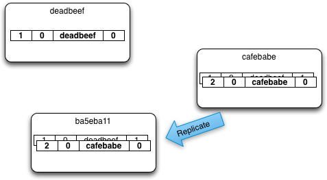

Each Rev of document Rev History is made up of the parts in the following table:

Rev fields and sizes:

<table>
	<tr>
		<th>Description
		<td>SeqStart
		<td>ConsecEdits
		<td>OrigId
		<td>EditId
		<th>Total
	<tr>
		<th>Bytes
		<td>6
		<td>2
		<td>16
		<td>4
		<th>28
</table>

SeqStart: The total number of edits on this document since the start of time. Limited to 48 bits.

ConsecEdits: The total number of consecutive edits made on this document by the same node.

OriginId: The FailoverId of node that originated the edit(s). FailoverIds can be moved to another node when there is smooth rebalance. Only one node at any time will have a particular FailoverId.

EditId: A value that is unique to all edits -- including all branches/conflicts -- of the same document by a node. When combined with the OriginId, they are globally unique across all edits and conflicts of this document.

When updating a document and the most recent Rev has a different OriginID from the current node, a new Rev is added to the revision history, with a SeqStart that is the sum of the previous Rev SeqStart and ConsecutiveEdits. If consecutive edits by the same node/FailoverId are made to the document, only the consecutive edits is adjusted.

###PackedRevTree###

The Packed Rev tree contains all the information necessary to construct a full revision tree, which includes the winner and conflicts:

<table>
	<tr>
		<th>Description
		<td>OrigIdDictionary
		<td>PackedRevHistory1
		<td>...
		<td>PackedRevHistoryN

	<tr>
		<th>Bytes
		<td>length(OrigIdDictionary)
		<td>length(PackedRevHistory1)
		<td>...
		<td>length(PackedRevHistoryN)
</table>

###OrigIdDictionary###

This is a mapping of OrigIds to integers that we use in a PackedRev entry. OrigIdOrdinal in PackedRev is an integer that maps to the Nth OrigId here.

<table>
	<tr>
		<th>Description
		<td>NumOrigIds
		<td>OrigIdEntry1…N
	<tr>
		<th>Bytes
		<td>3
		<td>16 * NumOrigIds
</table>

###PackedRevHistory###

This is a single branch of a RevHistory, from the leaf to either the root, or to a branch point in the revision history. This may be a branch off another PackedRevHistory, and other PackedRevHistory may branch off this. When all histories are expanded and the branch points joined, we'll have the in-memory representation of the full revision tree.

If the IsOffset bit is on, the entry contains the location in the current file where the doc body can be loaded, otherwise it's the UpdateSeq for that edit of the document.

If the IsDeletion bit is set and the IsOffset is not, then it's possible the older entry for branch of the document was purged. If so, this branch of the RevHistory should be dropped. This is discoverable on load and looking at the partition's current PurgeSeq, and if it's higher than the leafs expanded SeqStart + ConsecEdits, the branch should be pruned to the nearest branch point.

<table>
	<tr>
		<th>Description
		<td>SeqStart
		<td>NumPackedRevs
		<td>IsDeletion
		<td>IsOffset
		<td>DocBodyOffset or UpdateSeq
		<td>PackedRev1…N
	<tr>
		<th>Bit Range
		<td>0-47
		<td>48-63
		<td>64
		<td>65
		<td>66-93
		<td>94+
</table>

###PackedRev###

Format of PackedRev:

<table>
	<tr>
		<th>Description
		<td>ConsecEdits
		<td>OrigIdOrdinal
		<td>EditId
		<th>Total
	<tr>
		<th>Bytes
		<td>2
		<td>3
		<td>4
		<th>9
</table>

#Examples
## Single Document Edits and Conflicts for 3 clusters

This example details a single document edited and replicated on 3 different clusters, how the revision trees are updated, conflicts are identified, and interim winners chosen. The **bold revision entries on each node indicate the interim winner.**

(Note we don't use the full failover ids, in this example, but shortened hex ids that are pronounceable instead)

### Initial Edit And Replication
The document is created node deadbeaf (1-0-deadbeef-0) and replicates to cafebabe.

### Second Node Edits and replicates

cafebabe edits the document and creates revision 2-0-cafebabe-0, then replicates to ba5eba11.

### Edit Conflicts

ba5eba11 edits once (3-0-ba5eba11-0).

cafebabe edits again (2-1-cafebabe-0).

### Replicating Edit Conflicts
Bi-dir replication between cafebabe and ba5eba11 creates new branch/conflicts (2-1-cafebabe-0 and 3-0-ba5eba11-0).

### More Conflicting Edits

Revision 2-1-cafebabe-0 edited at ba5eba11 which becomes 4-0-ba5eba11-1.

Revision 2-1-cafebabe-0 edited at cafebabe which becomes 2-2-cafebabe-0.

### Replicating More Conflicts

cafebabe replicates 2-2-cafebabe-0 to deadbeef.

ba5eba11 replicates 4-0-ba5eba11-1 to deadbeef.

### More Conflicting Edits

Revision 2-2-cafebabe-0 edited at deadbeaf which becomes 5-1-deadbeef-1.

Revision 4-0-ba5eba11-1 edited at deadbeaf which becomes 5-1-deadbeef-2.

###Final Replication

deaadbeef replicates new edits to cafebabe and ba5eba11. All nodes now have all the same conflicts (5-0-deadbeef-1, 5-0-deadbeef-2, 3-0-ba5eba11-0) and revision 5-1-deadbeef-3 is selected interim winner at all nodes.

###Detail of full rev tree now on all nodes

All nodes will the have the same revision tree with the same histories.

